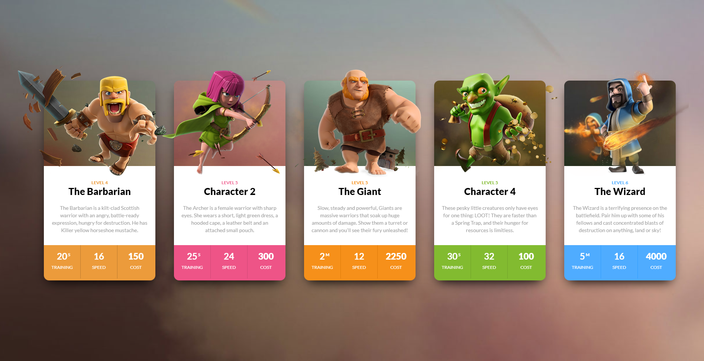

# **ASSIGNMENT 04**

Note: user need to change **background** and **text** color.

# **Task 01**

## **After Update**


```js
const clashCards = Array.from((document.getElementsByClassName("clash-card__unit-stats")))
const colors = ["#ec9b3b","#ee5487","#f6901a","#82bb30","#4facff"]
for(let i=0; i<clashCards.length; i++){
    clashCards[i].style.backgroundColor = colors[i];
}
const oneThird = Array.from(document.querySelectorAll(".one-third"))
oneThird.forEach((ele) => {
    ele.style.color = "white"
})


```
---