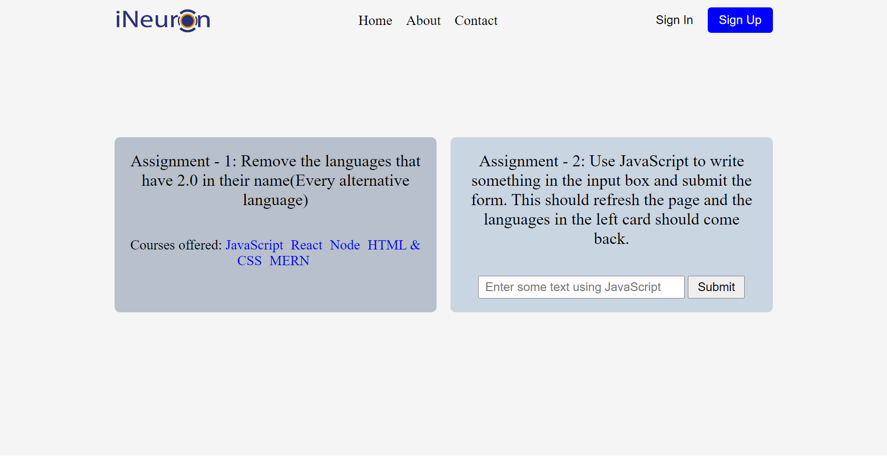

# **Assignment 07**
>Note: remove the language that have 2.0 in their name and use javascript in the input box and submit the form . This should refresh the page and the language in the left card should come back.
# **Task 01**

# **After Update**



```js
let aTags = Array.from(document.getElementsByTagName("a"));
const mainLanguages = document.getElementsByClassName("main__languages")[0]
const input = document.getElementsByTagName("input")[0];
const submitBtn = document.getElementsByTagName("button")[2]
submitBtn.removeAttribute("disabled");
input.removeAttribute("disabled");

aTags.forEach(ele => {
    if (ele.innerText.includes("2.0")){
        mainLanguages.removeChild(ele)
    }
})

let inputStore = localStorage.getItem("inputs")
if (inputStore){
    inputStore = JSON.parse(localStorage.getItem("inputs"))
} else {
    inputStore = []
}

submitBtn.addEventListener("click", () => {
    inputStore.push(input.value)
    localStorage.setItem("inputs", JSON.stringify(inputStore))
    appendInput(input.value);
    
})

const appendInput = (inputTaken) => {
    const aTag = document.createElement("a")
    aTag.href = 'https://www.ineuron.ai';    
    aTag.target = '_blank';
    aTag.innerText = inputTaken
    mainLanguages.appendChild(aTag)
    console.log(aTag);
}

const getInput = JSON.parse(localStorage.getItem("inputs"));
getInput.forEach((note) => {
appendInput(note);
});
```
