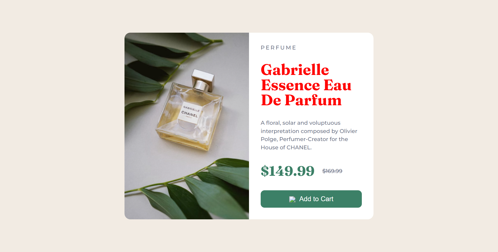

# **Assignment 09**

>Note: user need to change Text(heading) Color **BLACK** To **RED**.

# **Task 01**

## **After Update**


```js
const title = document.getElementsByTagName("h1")[0]
title.style.color = "red"
```
---

>Note: user need to change Button backgroundColor **GREEN** To **RED** and **cursor pointer**.

# **Task 02**

## **After Update**


```js
const button = document.getElementsByTagName("button")[0]
button.style.backgroundColor = "red"
button.style.cursor = "pointer"
```