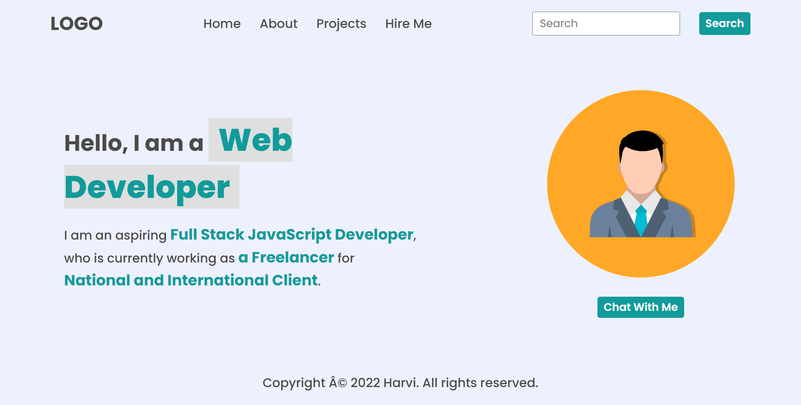
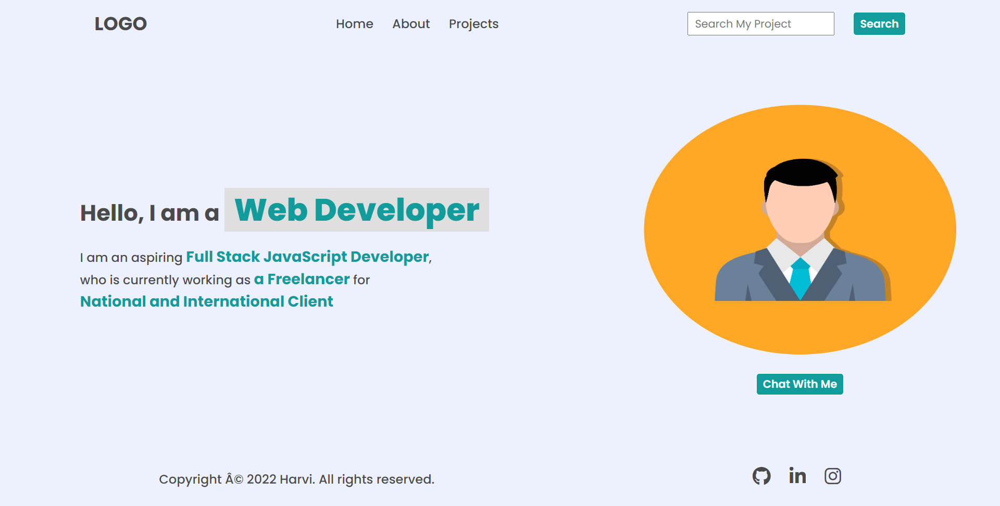
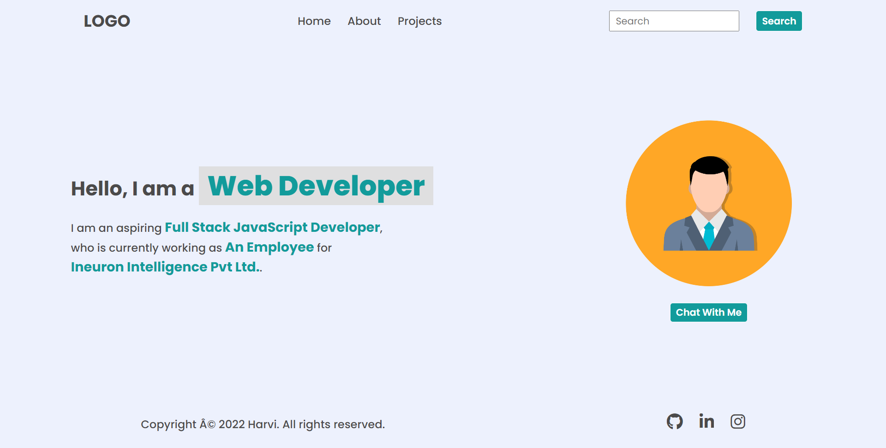
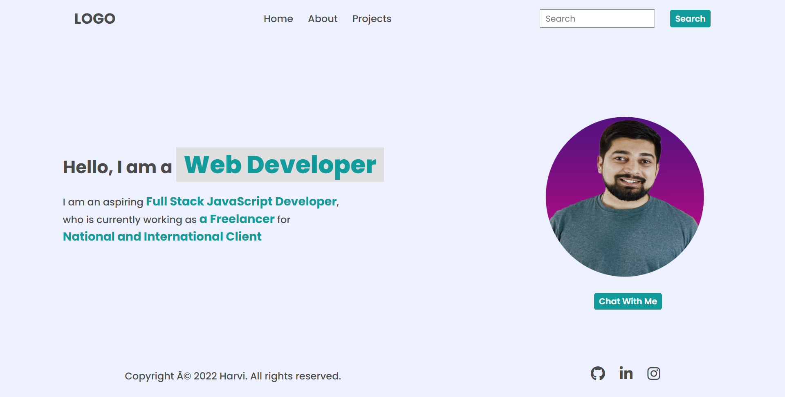
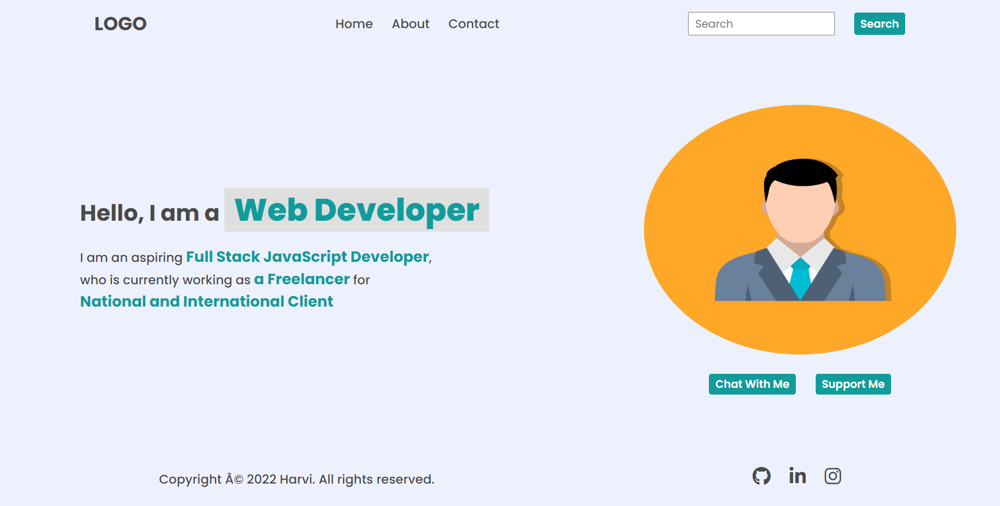
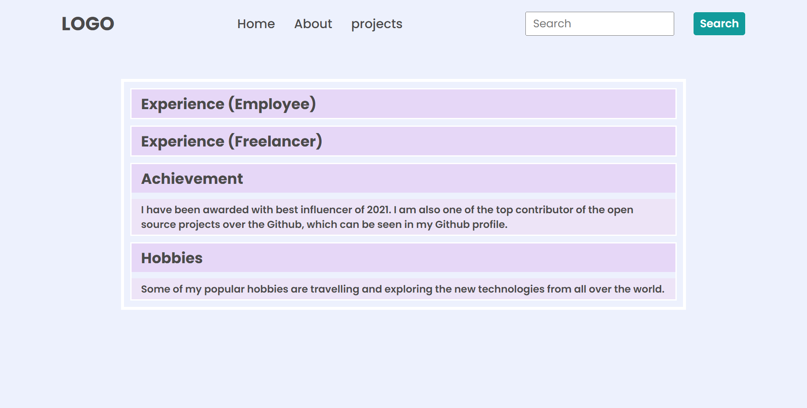
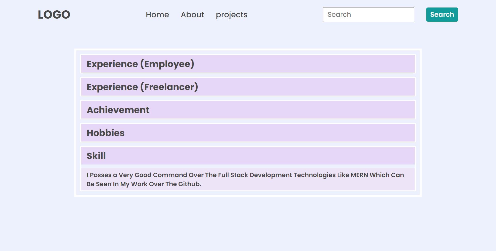
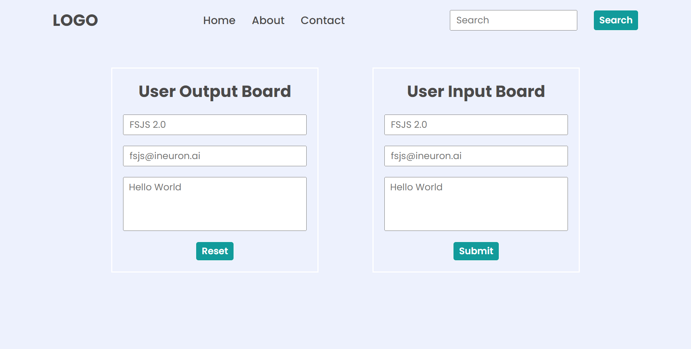

# **Dom Assignment01**

---

## **Task 1**


The user has to append a new element in the navigation menu name **Hire Me** after the **Projects**.

## **After Update**



## **Project Solution**
```js
document.querySelector("#list").innerHTML = "Projects";
let element = document.createElement("li");
element.innerHTML = "<a>Hire Me</a>";
let parent = document.querySelector("header nav ul");
parent.appendChild(element);

```

---

## **Task 2**

The user need to change the placeholder message from **"Search"** to **"Search My Project"** 

## **After Update**


## **Project Solution**
```js
document.querySelector("#list").innerHTML = "Projects";
let a= document.querySelector("search-feild input");
a.Placeholder ="Search My Project" 
```
---

## **Task 3**
The user has to change **"a freelancer"** to **"An Employee"** and **"National and International Client"** to **"Ineuron Intelligence Pvt Ltd."**

## **After Update**



## **Project Solution**
```js
document.querySelector("#list").innerHTML = "Projects";
let element =document.querySelectorall(".hero-left-section p sapn");
element[1] .innerHTML ="Employee"
element[2] .innerHTML ="Ineuron Intelligence Pvt Ltd."
```

---

## **Task 4**
The user need to change the **"Avtar"** image with the image of **"HITESH SIR"**.


## **After Update**


```js
document.querySelector("#list").innerHTML = "Projects";
 let image =document.querySelector(".hero-right-section img");
 image.src="./images/Hitesh-sir.png";
 ```

 ---

 ## **Task 5**
 The user need to create another button named **"SUPPORT ME"** and add it , next to **"Chat with Me"** button below Avtar.

 ## **After Update**

 

 ```js
 let element = document.querySelector(".hero-right-section-btns");
let newBtn = document.createElement("button");
newBtn.innerText="Support Me";
element.appendChild(newBtn);
```
---

# **Dom Assignment 02**


## **Task 01**

The user need to change Background color of **"heading"** and **"paragraph"**


## **After Update**


```js

let list = document.querySelector("#listt");
list.innerText="projects";

// Get all paragraphs
let paragraphs = document.getElementsByTagName("p");

// Loop through all paragraphs and change background color
for (let i = 0; i < paragraphs.length; i++) {
  paragraphs[i].style.backgroundColor = "#ede4f7";
}

// Get all Headings
let heading = document.getElementsByTagName("h3");

// Loop through all heading and change background color
for (let i = 0; i < heading.length; i++) {
  heading[i].style.backgroundColor = "#e6d7f7";
}

```

---

## **Task 02**

The user need to add new **"heading"** and **"paragraph"**


## **After Update**


```js

//change nav **contact** to **"projects"**

let list = document.querySelector("#listt");
list.innerText="projects";


////create div ,heading and para
let parent=document.querySelector(".accordian-wrapper");
let element = document.createElement("div");
element.classList.add("accordian");

let head =document.createElement("h3");
let para =document.createElement("p");

para.innerText="I Posses a Very Good Command Over The Full Stack Development Technologies Like MERN Which Can Be Seen In My Work Over The Github.";
para.style.display="none";

head.innerText="Skill";
element.appendChild(head);
element.appendChild(para);
parent.appendChild(element);


//change bg-color of heading and paragraphs
// Get all paragraphs
let paragraphs = document.getElementsByTagName("p");

// Loop through all paragraphs and change background color
for (let i = 0; i < paragraphs.length; i++) {
  paragraphs[i].style.backgroundColor = "#ede4f7";
}

// Get all Headings
let heading = document.getElementsByTagName("h3");

// Loop through all heading and change background color
for (let i = 0; i < heading.length; i++) {
  heading[i].style.backgroundColor = "#e6d7f7";
}


//on click function

let accordian = document.querySelectorAll(".accordian h3");
accordian.forEach((element) => {
  element.addEventListener("click", () => {
    let para = element.nextElementSibling;
    if (para.style.display === "block") {
      para.style.display = "none";
    } else {
      para.style.display = "block";
    }
  });
});


```

---

# **Dom Assignment 03**


## **Task 01**

The user need to change placeholder of **"user output board"** and **"user input board"**


## **After Update**



```js
//user output board
document.getElementsByClassName('enterName')[0].placeholder='FSJS 2.0';
document.getElementsByClassName('enterMail')[0].placeholder='fsjs@ineuron.ai';
document.getElementsByClassName('enterMessage')[0].placeholder='Hello World';


//user input board
document.getElementsByClassName('userName')[0].placeholder='FSJS 2.0';
document.getElementsByClassName('userEmail')[0].placeholder='fsjs@ineuron.ai';
document.getElementsByClassName('userMessage')[0].placeholder='Hello World';
```
---