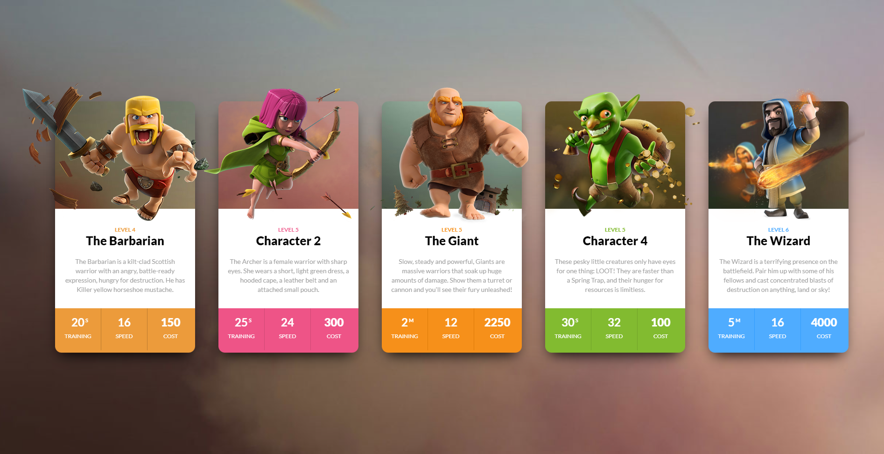
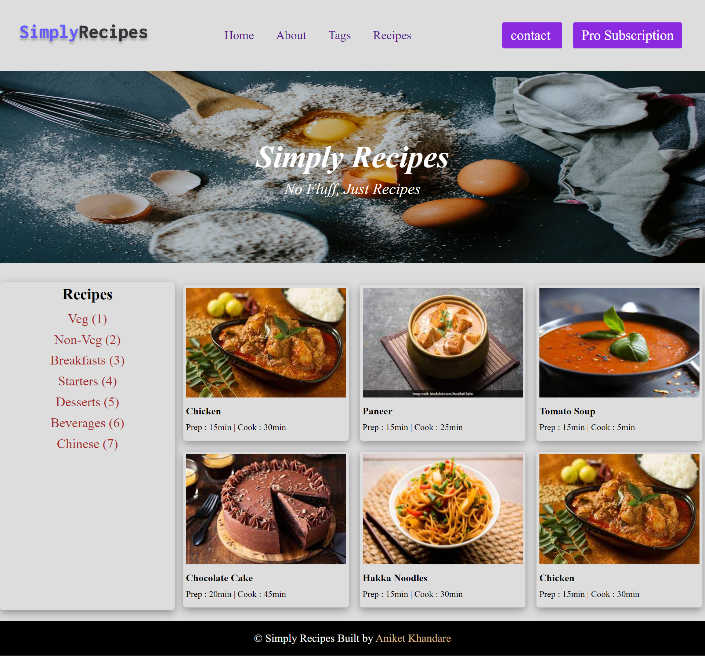
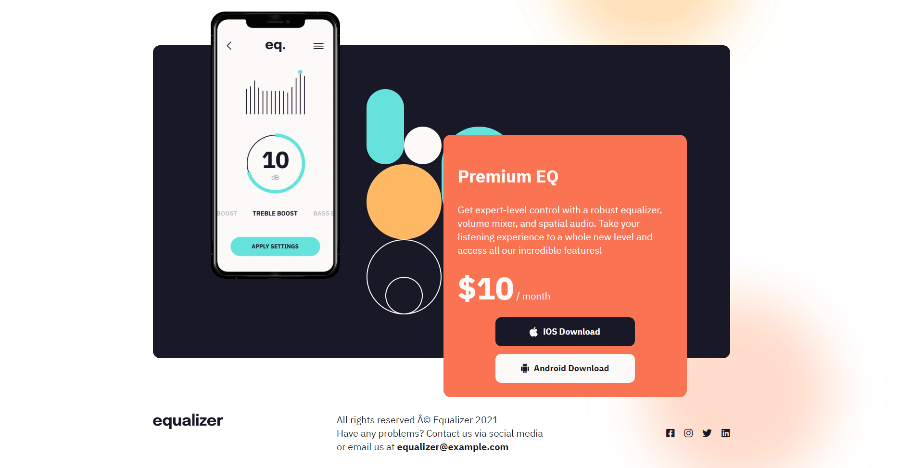
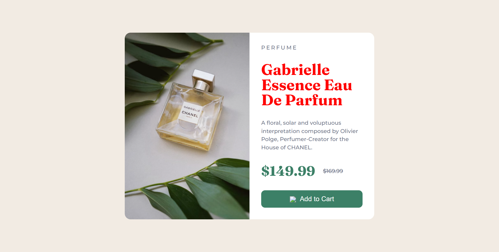
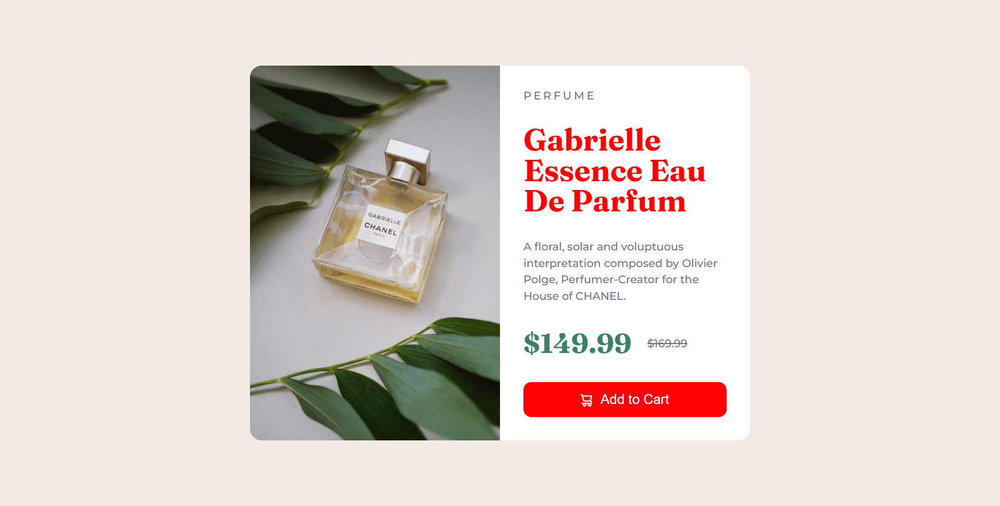

# **Dom Assignment01**

---

## **Task 1**


The user has to append a new element in the navigation menu name **Hire Me** after the **Projects**.

## **After Update**


## **Project Solution**
```js
document.querySelector("#list").innerHTML = "Projects";
let element = document.createElement("li");
element.innerHTML = "<a>Hire Me</a>";
let parent = document.querySelector("header nav ul");
parent.appendChild(element);

```

---

## **Task 2**

The user need to change the placeholder message from **"Search"** to **"Search My Project"** 

## **After Update**


## **Project Solution**
```js
document.querySelector("#list").innerHTML = "Projects";
let a= document.querySelector("search-feild input");
a.Placeholder ="Search My Project" 
```
---

## **Task 3**
The user has to change **"a freelancer"** to **"An Employee"** and **"National and International Client"** to **"Ineuron Intelligence Pvt Ltd."**

## **After Update**


## **Project Solution**
```js
document.querySelector("#list").innerHTML = "Projects";
let element =document.querySelectorall(".hero-left-section p sapn");
element[1] .innerHTML ="Employee"
element[2] .innerHTML ="Ineuron Intelligence Pvt Ltd."
```

---

## **Task 4**
The user need to change the **"Avtar"** image with the image of **"HITESH SIR"**.


## **After Update**


## **Project Solution**

```js
document.querySelector("#list").innerHTML = "Projects";
 let image =document.querySelector(".hero-right-section img");
 image.src="./images/Hitesh-sir.png";
 ```

 ---

 ## **Task 5**
 The user need to create another button named **"SUPPORT ME"** and add it , next to **"Chat with Me"** button below Avtar.

 ## **After Update**

 


## **Project Solution**
 ```js
 let element = document.querySelector(".hero-right-section-btns");
let newBtn = document.createElement("button");
newBtn.innerText="Support Me";
element.appendChild(newBtn);
```
---

# **Dom Assignment 02**


## **Task 01**

The user need to change Background color of **"heading"** and **"paragraph"**


## **After Update**


## **Project Solution**

```js

let list = document.querySelector("#listt");
list.innerText="projects";

// Get all paragraphs
let paragraphs = document.getElementsByTagName("p");

// Loop through all paragraphs and change background color
for (let i = 0; i < paragraphs.length; i++) {
  paragraphs[i].style.backgroundColor = "#ede4f7";
}

// Get all Headings
let heading = document.getElementsByTagName("h3");

// Loop through all heading and change background color
for (let i = 0; i < heading.length; i++) {
  heading[i].style.backgroundColor = "#e6d7f7";
}

```

---

## **Task 02**

The user need to add new **"heading"** and **"paragraph"**


## **After Update**


## **Project Solution**

```js

//change nav **contact** to **"projects"**

let list = document.querySelector("#listt");
list.innerText="projects";


////create div ,heading and para
let parent=document.querySelector(".accordian-wrapper");
let element = document.createElement("div");
element.classList.add("accordian");

let head =document.createElement("h3");
let para =document.createElement("p");

para.innerText="I Posses a Very Good Command Over The Full Stack Development Technologies Like MERN Which Can Be Seen In My Work Over The Github.";
para.style.display="none";

head.innerText="Skill";
element.appendChild(head);
element.appendChild(para);
parent.appendChild(element);


//change bg-color of heading and paragraphs
// Get all paragraphs
let paragraphs = document.getElementsByTagName("p");

// Loop through all paragraphs and change background color
for (let i = 0; i < paragraphs.length; i++) {
  paragraphs[i].style.backgroundColor = "#ede4f7";
}

// Get all Headings
let heading = document.getElementsByTagName("h3");

// Loop through all heading and change background color
for (let i = 0; i < heading.length; i++) {
  heading[i].style.backgroundColor = "#e6d7f7";
}


//on click function

let accordian = document.querySelectorAll(".accordian h3");
accordian.forEach((element) => {
  element.addEventListener("click", () => {
    let para = element.nextElementSibling;
    if (para.style.display === "block") {
      para.style.display = "none";
    } else {
      para.style.display = "block";
    }
  });
});


```

---

# **Dom Assignment 03**


## **Task 01**

The user need to change placeholder of **"user output board"** and **"user input board"**


## **After Update**


## **Project Solution**

```js
//user output board
document.getElementsByClassName('enterName')[0].placeholder='FSJS 2.0';
document.getElementsByClassName('enterMail')[0].placeholder='fsjs@ineuron.ai';
document.getElementsByClassName('enterMessage')[0].placeholder='Hello World';


//user input board
document.getElementsByClassName('userName')[0].placeholder='FSJS 2.0';
document.getElementsByClassName('userEmail')[0].placeholder='fsjs@ineuron.ai';
document.getElementsByClassName('userMessage')[0].placeholder='Hello World';
```
---


# **ASSIGNMENT 04**

Note: user need to change **background** and **text** color.

## **Task 01**

## **After Update**


## **Project Solution**

```js
const clashCards = Array.from((document.getElementsByClassName("clash-card__unit-stats")))
const colors = ["#ec9b3b","#ee5487","#f6901a","#82bb30","#4facff"]
for(let i=0; i<clashCards.length; i++){
    clashCards[i].style.backgroundColor = colors[i];
}
const oneThird = Array.from(document.querySelectorAll(".one-third"))
oneThird.forEach((ele) => {
    ele.style.color = "white"
})


```
---


# **ASSIGNMENT 05**

Note: user need to add button **Pro Subscription** and add **6th card** .

## **TASK 01**

## **AFTER UPDATE**


## **Project Solution**

```js
const buttonDiv = document.querySelectorAll(".nav-center div")[2];
let x = document.createElement("a")
x.classList.add("btn")
x.textContent="Pro Subscription"
buttonDiv.append(x)

const tagDiv = document.querySelectorAll(".tags-container div")[0]
const newTag = document.createElement("a");
newTag.setAttribute("href","#");
newTag.innerText = "Chinese (7)"
tagDiv.appendChild(newTag)

const recipeGallery = document.querySelector(".recipe-gallery");

const newCard = document.createElement("div");
newCard.className = "card";

const recipeText = document.createElement("a");
recipeText.className = "recipe-text";
recipeText.setAttribute("href","#");

const image = document.createElement("img");
image.className = "recipe-img";
image.setAttribute("src","./img/recipe-1.jpeg");

const recipeName = document.createElement("h5");
recipeName.className = "recipe-name";
recipeName.innerText = "Chicken";
const recipePara = document.createElement("p");
recipePara.className = "recipe-disp";
recipePara.innerText = "Prep : 15min | Cook : 30min";

recipeText.appendChild(image);
recipeText.appendChild(recipeName);
recipeText.appendChild(recipePara);
newCard.appendChild(recipeText);
recipeGallery.appendChild(newCard);

const name1 = document.querySelector(".page-footer p a");
name1.innerText = "Aniket Khandare";
```
---


# **Assignment No 06**
---
Note: user need to change header from ** equlizer **  to **Ineuron image**`` and price tag from **$4** to **$10** .

## **Task 02**

## **After Update**

## **Project Solution**


```js
const headerImg = document.querySelectorAll("header img")[0]
headerImg.setAttribute("src","./assets/ineuron-logo.png");
```

---


## **Task 02**

## **After Update**



## **Project Solution**

```js

const span = document.querySelectorAll(".app_price span")[0]
span.innerText = "$10"

const footerSocial = document.querySelector(".footer_social");
const footerSocialIco = document.createElement("div")
footerSocialIco.className = "footer_social_ico";
footerSocialIco.innerHTML = `<i class="fa-brands fa-linkedin"></i>`;
footerSocial.appendChild(footerSocialIco);

```

---


# **Assignment 07**
>Note: remove the language that have 2.0 in their name and use javascript in the input box and submit the form . This should refresh the page and the language in the left card should come back.
# **Task 01**

# **After Update**


## **Project Solution**


```js
let aTags = Array.from(document.getElementsByTagName("a"));
const mainLanguages = document.getElementsByClassName("main__languages")[0]
const input = document.getElementsByTagName("input")[0];
const submitBtn = document.getElementsByTagName("button")[2]
submitBtn.removeAttribute("disabled");
input.removeAttribute("disabled");

aTags.forEach(ele => {
    if (ele.innerText.includes("2.0")){
        mainLanguages.removeChild(ele)
    }
})

let inputStore = localStorage.getItem("inputs")
if (inputStore){
    inputStore = JSON.parse(localStorage.getItem("inputs"))
} else {
    inputStore = []
}

submitBtn.addEventListener("click", () => {
    inputStore.push(input.value)
    localStorage.setItem("inputs", JSON.stringify(inputStore))
    appendInput(input.value);
    
})

const appendInput = (inputTaken) => {
    const aTag = document.createElement("a")
    aTag.href = 'https://www.ineuron.ai';    
    aTag.target = '_blank';
    aTag.innerText = inputTaken
    mainLanguages.appendChild(aTag)
    console.log(aTag);
}

const getInput = JSON.parse(localStorage.getItem("inputs"));
getInput.forEach((note) => {
appendInput(note);
});

```


# **Assignment 08**
>Note: user need to add borde in red color , set Aside in scroll and add **heading** and **paragraph**.

# **Task 01**

## **After Update** 

1[output image](./Dom08/images/dom-assignment-08-task-01.png)

## **Project Solution**

```js

const sideBar = document.getElementsByTagName("aside")[0];
sideBar.style.border = "4px solid red";
sideBar.style.overflowY = "scroll";

const horizontalLine = document.createElement("hr");
horizontalLine.className = "hr-line";
sideBar.appendChild(horizontalLine);

const heading = document.createElement("h2");
const para = document.createElement("p");
heading.textContent = "This is my custom heading";
para.textContent = "This is my custom paragraph.";
sideBar.appendChild(heading);
sideBar.appendChild(para);
heading.className = "new-head";
para.className = "new-p";
```

---

# **Task 02**

## **After Update** 
1[output image](./Dom08/images/dom-assignment-08-task-02.png)


## **Project Solution**

```js
document.body.style.backgroundImage = "none";
```
---

# **Task 03**

## **After Update** 
1[output image](./Dom08/images/dom-assignment-08-task-03.png)


## **Project Solution**
```js
const navbarToggle = document.querySelector(".navbar-toggler");
const collapseNavbar = document.getElementsByClassName('collapse')[0];

navbarToggle.addEventListener("click", ()=>{
    collapseNavbar.style.display = "flex";
    navbarToggle.addEventListener("click", () =>{
        collapseNavbar.style.display = "none";
    })
})

```
---

# **Assignment 09**

>Note: user need to change Text(heading) Color **BLACK** To **RED**.

# **Task 01**

## **After Update**


## **Project Solution**

```js
const title = document.getElementsByTagName("h1")[0]
title.style.color = "red"
```
---

>Note: user need to change Button backgroundColor **GREEN** To **RED** and **cursor pointer**.

# **Task 02**

## **After Update**


## **Project Solution**

```js
const button = document.getElementsByTagName("button")[0];
button.style.backgroundColor = "red";
button.style.cursor = "pointer";

```
---


